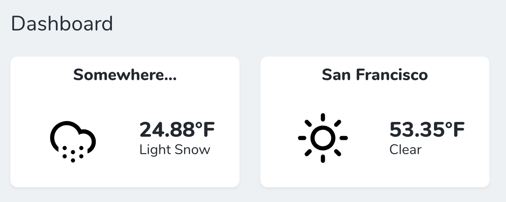

# A Nova tool to help debug failed jobs

[](https://packagist.org/packages/kregel/kregel/nova-weather-cards)
[](https://packagist.org/packages/kregel/kregel/nova-weather-cards)



## Installation

You can install the package in to a Laravel app that uses [Nova](https://nova.laravel.com) via composer:

```bash
composer require kregel/nova-weather-cards
```

Next up, you must register the tool with Nova. This is typically done in the `cards` method of the `NovaServiceProvider`.

## Usage

```php
// in app/Providers/NovaServiceProvider.php

// ...

public function cards()
{
    return [
        // ...
        (new \Kregel\NovaWeatherCards\Weather)->withMeta([
            'name' => 'San Francisco',
            'coords' => [
                37.7749,
                122.4194,
            ]
        ]),
        // If you don't define coordinates it will default to your location.
        (new \Kregel\NovaWeatherCards\Weather)->withMeta([
            'name' => 'Current location',
        ]),
        // Or you could forego all configuration. (which will default to no title, and your current location)
        new \Kregel\NovaWeatherCards\Weather,
    ];
}
```

## Contributing

Please see [CONTRIBUTING](CONTRIBUTING.md) for details.

### Security

If you discover any security related issues, please email github@austinkregel.com instead of using the issue tracker.

## Credits

- [Austin kregel](https://github.com/austinkregel)

## License

The MIT License (MIT). Please see [License File](LICENSE.md) for more information.

## Support on Beerpay
Hey dude! Help me out for a couple of :beers:!

[](https://beerpay.io/austinkregel/nova-failed-jobs-tool)  [](https://beerpay.io/austinkregel/nova-failed-jobs-tool?focus=wish)